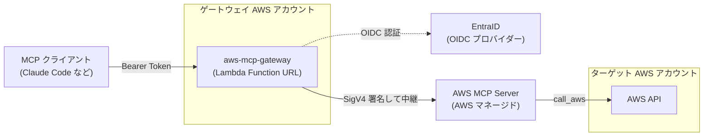
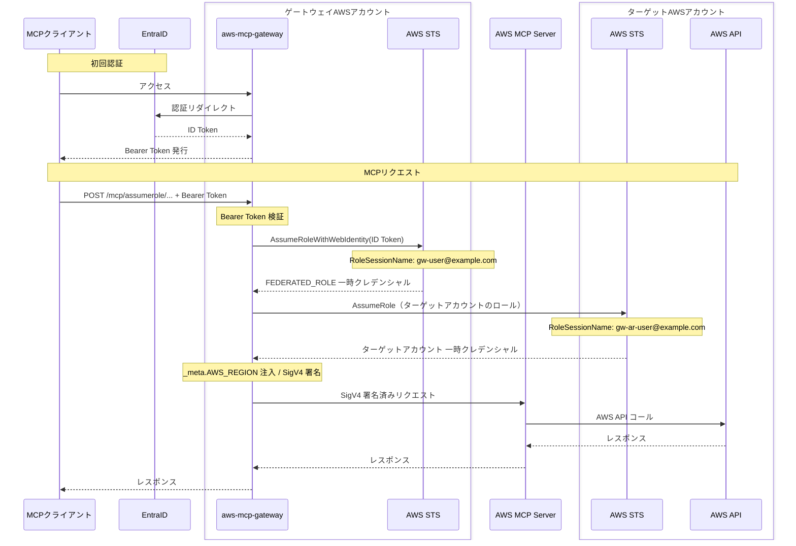

組織で Claude Code などの MCP クライアントから AWS を操作するときの認証をどうするか問題を解決するために、Remote MCP サーバーを作りました。

https://github.com/youyo/aws-mcp-gateway

## mcp-proxy-for-aws を使わない理由

MCP 経由で AWS にアクセスするには、AWS MCP Server にローカルから接続する [mcp-proxy-for-aws](https://github.com/aws/mcp-proxy-for-aws) を使います。ローカルで `uvx mcp-proxy-for-aws` するだけで動くので、個人で使うには十分です。

ただそのためにはローカルに `~/.aws/credentials` や `~/.aws/config` の設定が必要です。
できればローカルに認証情報を持たせずに済ませられないか？と考え、Remote MCP サーバーとして動かしてゲートウェイ側で一元管理する形にしてみました。  
また、現在会社で利用している Claude Team では、その他サービスの Remote MCP サーバーを含めてすべて EntraID による認証に統一しています。AWS へのアクセスについても他と同じように統一したかったというのもあります。

## aws-mcp-gateway とは

一言で言うと「OIDC 認証付き AWS MCP Server リバースプロキシ」です。

- EntraID などの OIDC プロバイダーで認証
- 認証済みリクエストに AWS SigV4 署名を付与して AWS MCP Server に中継
- per-user のクレデンシャル管理（CloudTrail 追跡対応）
- パスルーティングでマルチアカウント対応

全体構成はこうなっています。



クライアントから見えるのはゲートウェイの URL だけです。AWS のクレデンシャルはゲートウェイより先にしか存在しません。

MCP プロトコルの中身は一切パースしていません。`httputil.ReverseProxy` に HTTP レベルの転送を任せているだけです。

## 認証フロー

### EntraID OIDC → Web Identity Federation → クロスアカウント AssumeRole

`IAM_MODE=federated` に AssumeRole パスルーティングを組み合わせた場合のフロー全体です。やっていることは 4 ステップです。

1. EntraID で OIDC 認証して Bearer Token を発行（初回のみ）
2. EntraID の ID Token で `AssumeRoleWithWebIdentity` し、ユーザーごとの一時クレデンシャルを取得
3. パスで指定されたターゲットアカウントのロールに `AssumeRole`
4. ターゲットアカウントのクレデンシャルで SigV4 署名して AWS MCP Server に中継



EntraID が発行した ID Token をそのまま STS に渡して Web Identity Federation で認証します。社内の認証基盤をそのまま使えるのがいいところです。

`_meta.AWS_REGION` の注入は AWS MCP Server がリージョン指定を受け取るために必要です。クライアントが指定している場合はそちらを優先します。

リクエストボディを全て読み込んでいるのは SigV4 署名のペイロードハッシュ計算のためです。サイズは最大 6 MiB に制限しています（Lambda Function URL の上限に合わせています）。

### CloudTrail でのユーザー追跡

RoleSessionName に `gw-ar-{email}` という形式でメールアドレスを埋め込んでいます。

CloudTrail にはこのように記録されます：

```
arn:aws:sts::<TARGET_ACCOUNT>:assumed-role/<ROLE_NAME>/gw-ar-user@example.com
```

CloudTrail を見るだけで誰がその API を呼んだかが分かります。ゲートウェイのアクセスログと突き合わせる手間がなくなります。

## マルチアカウント対応

パスルーティングで複数 AWS アカウントへのアクセスを管理しています。

```
/mcp/assumerole/accounts/{account_id}/rolename/{role_name}
```

Claude Code の設定例です：

```json
{
  "mcpServers": {
    "aws-prod": {
      "url": "https://gateway.example.com/mcp/assumerole/accounts/123456789012/rolename/AwsMcpGatewayRole"
    },
    "aws-staging": {
      "url": "https://gateway.example.com/mcp/assumerole/accounts/210987654321/rolename/StagingMcpRole"
    }
  }
}
```

`ASSUMEROLE_ALLOWED_ACCOUNTS` と `ASSUMEROLE_ALLOWED_ROLE_NAMES` で許可するアカウントとロール名を明示的に指定する必要があります（deny by default）。Confused Deputy 攻撃対策の `ExternalId` も設定できます。

ターゲットアカウント側の IAM ロール設定を CloudFormation StackSet で全アカウントに配布する CDK コードも同梱しています（`cdk-assume-role-target/`）。

## クレデンシャルキャッシュ

STS への呼び出し回数を減らすためにキャッシュを実装しています。

| キャッシュの種類 | キー |
|---|---|
| federated モード | `{sub}::{ID Token fingerprint}` |
| assumerole パスルーティング | `{account_id}::{role_name}::{sub}` |

ID Token が更新されたら同じ sub の古いキャッシュを自動でパージします。`sync.Map` の `LoadOrStore` で thundering herd も抑制しています。

キャッシュ TTL はデフォルト 55 分です（STS の一時クレデンシャル 60 分 - ExpiryWindow 5 分）。`ASSUMEROLE_MAX_CACHE_TTL` で短縮できるので、IdP での revocation に素早く対応したい場合に使えます。

## デプロイ

Lambda Function URL を使うのが一番手軽です。Lambda Web Adapter で動かしています。ECS や EC2 でも動きます。

CDK のコードを同梱しています：

- `cdk-lambda/` : Lambda デプロイ用スタック（Function URL + DynamoDB セッションストア）
- `cdk-assume-role-target/` : ターゲットアカウント IAM ロール + StackSet 配布

セッションストアはデフォルトでメモリですが、Lambda のような複数インスタンス環境では DynamoDB が必要です（`STORE_BACKEND=dynamodb`）。

## まとめ

- ローカルに認証情報を置かず、ゲートウェイ側で一元管理できる
- 社内の EntraID 認証基盤をそのまま MCP 経由の AWS アクセスに適用できる
- CloudTrail でユーザー単位の追跡が可能（RoleSessionName に email を埋め込み）
- パスルーティングで複数 AWS アカウントをシンプルに管理できる

AWS アカウント数分の MCP サーバー設定が増えてしまうというのがいまいちな部分ですが、MCP の Lazy Loading があるのでギリギリ許容範囲かなと思っています。この辺の改善策ができたら更新しようと思います🙂
