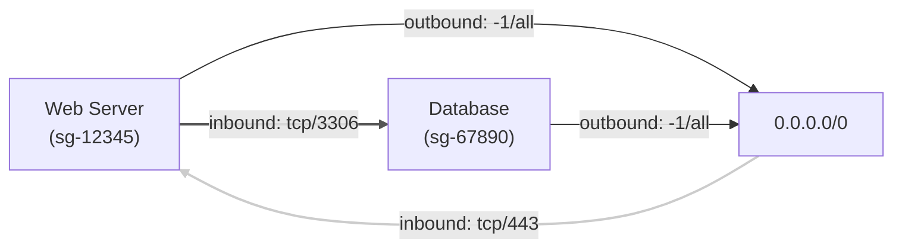
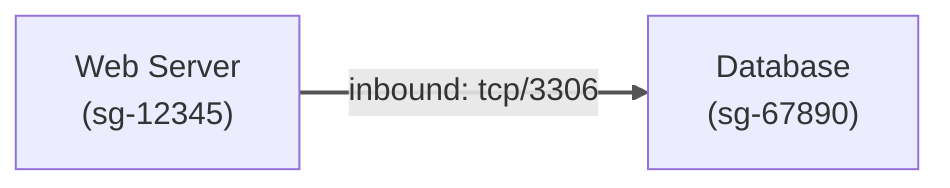
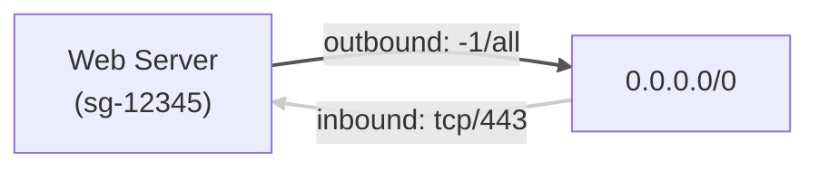
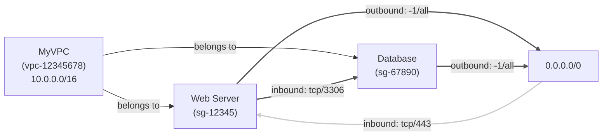

## はじめに

AWS のセキュリティグループは、インスタンスへのトラフィックを制御する重要な仕組みですが、複数の VPC やリージョンにまたがる環境では、セキュリティグループの関係性を把握することが難しくなります。特に大規模な環境では、どのセキュリティグループがどのリソースに関連付けられているのか、またそれらの間の通信経路を理解することは容易ではありません。

この課題を解決するために開発したのが「sgmap」です。sgmap は、AWS のセキュリティグループの関係性を可視化し、セキュリティ設定の理解と管理を容易にするツールです。

## sgmap とは

sgmap は、AWS のセキュリティグループの接続関係を可視化するための CLI ツールおよびライブラリです。指定した VPC 内のセキュリティグループ間の接続関係を mermaid 記法のフローチャートまたは JSON 形式で出力します。

https://github.com/youyo/sgmap

## インストール方法

sgmap は、PyPI からインストールすることができます：

```bash
pip install sgmap
```

## 使用方法

### 基本的な使用方法

sgmap を使用するには、AWS の認証情報が適切に設定されている必要があります。AWS CLI の設定が完了していれば、以下のコマンドで実行できます：

```bash
sgmap --vpc-id vpc-12345678
```

特定のセキュリティグループのみを表示する場合：

```bash
sgmap --vpc-id vpc-12345678 --security-group-id sg-87654321
```

### コマンドラインオプション

sgmap は、以下のコマンドラインオプションをサポートしています：

| オプション                  | 説明                                                                                          |
| --------------------------- | --------------------------------------------------------------------------------------------- |
| `--vpc-id`, `-v`            | 分析対象の VPC ID（必須）                                                                     |
| `--security-group-id`, `-s` | 特定のセキュリティグループ ID を指定して分析（オプション）                                    |
| `--json`, `-j`              | JSON 形式で出力（デフォルトは mermaid 記法）                                                  |
| `--with-vpc`                | mermaid ダイアグラムに VPC を含める（デフォルトではセキュリティグループとその接続のみを表示） |

### 出力形式

sgmap は、デフォルトで mermaid 記法のフローチャートを生成します。

```bash
sgmap --vpc-id vpc-12345678 > security-groups.md
```

また、JSON 形式での出力も可能です：

```bash
sgmap --vpc-id vpc-12345678 --json > security-groups.json
```

### mermaid 記法の出力例

sgmap が生成する mermaid 記法のフローチャートは、以下のような形式になります：



このようなフローチャートを使用することで、セキュリティグループ間の関係性を視覚的に理解することができます。インバウンドルールは薄い色で、アウトバウンドルールは濃い色で表示されます。

### JSON 形式の出力例

JSON 形式の出力は、以下のような構造になります：

```json
{
  "vpc": {
    "id": "vpc-12345678",
    "cidr": "10.0.0.0/16",
    "name": "MyVPC",
    "tags": [
      {
        "Key": "Name",
        "Value": "MyVPC"
      }
    ]
  },
  "security_groups": {
    "sg-12345": {
      "name": "Web Server",
      "description": "Web server security group",
      "tags": [],
      "inbound": [
        {
          "type": "cidr",
          "id": "0.0.0.0/0",
          "name": "0.0.0.0/0",
          "protocol": "tcp",
          "from_port": 443,
          "to_port": 443,
          "description": "HTTPS from anywhere"
        }
      ],
      "outbound": [
        {
          "type": "cidr",
          "id": "0.0.0.0/0",
          "name": "0.0.0.0/0",
          "protocol": "-1",
          "from_port": "all",
          "to_port": "all",
          "description": "All traffic"
        },
        {
          "type": "security_group",
          "id": "sg-67890",
          "name": "Database",
          "protocol": "tcp",
          "from_port": 3306,
          "to_port": 3306,
          "description": "MySQL access"
        }
      ]
    },
    "sg-67890": {
      "name": "Database",
      "description": "Database security group",
      "tags": [],
      "inbound": [
        {
          "type": "security_group",
          "id": "sg-12345",
          "name": "Web Server",
          "protocol": "tcp",
          "from_port": 3306,
          "to_port": 3306,
          "description": "MySQL access from web servers"
        }
      ],
      "outbound": [
        {
          "type": "cidr",
          "id": "0.0.0.0/0",
          "name": "0.0.0.0/0",
          "protocol": "-1",
          "from_port": "all",
          "to_port": "all",
          "description": "All traffic"
        }
      ]
    }
  }
}
```

## 主な機能

### 1. セキュリティグループの関係性の可視化

sgmap の最も重要な機能は、セキュリティグループ間の関係性を視覚的に表現することです。これにより、どのセキュリティグループがどのセキュリティグループを参照しているかを一目で確認できます。

例えば、Web サーバー用のセキュリティグループがデータベース用のセキュリティグループを参照している場合、その関係性がグラフとして表示されます。また、各セキュリティグループのインバウンド/アウトバウンドルールも確認できます。

### 2. インバウンド/アウトバウンドルールの区別

sgmap は、インバウンドルールとアウトバウンドルールを明確に区別して表示します。mermaid 記法の出力では、インバウンドルールは薄い色で、アウトバウンドルールは濃い色で表示されます。これにより、通信の方向を視覚的に理解することができます。



### 3. CIDR 範囲の表示

sgmap は、セキュリティグループだけでなく、CIDR 範囲（IP アドレス範囲）も表示します。これにより、インターネットからのアクセスや特定の IP アドレス範囲からのアクセスも視覚化できます。



### 4. VPC の表示オプション

`--with-vpc`オプションを使用すると、VPC も含めた図を生成できます。これにより、セキュリティグループがどの VPC に属しているかを視覚的に理解することができます。



### 5. Python ライブラリとしての利用

sgmap は、CLI ツールとしてだけでなく、Python ライブラリとしても利用できます。これにより、自動化スクリプトやカスタムツールに sgmap の機能を組み込むことができます。

```python
import sgmap

# VPC内のセキュリティグループ情報を取得
vpc_and_sgs = sgmap.get_security_groups('vpc-12345678')

# 特定のセキュリティグループのみを取得する場合
# vpc_and_sgs = sgmap.get_security_groups('vpc-12345678', 'sg-87654321')

# セキュリティグループの接続関係を分析
connections = sgmap.analyze_security_group_connections(vpc_and_sgs)

# mermaid記法のダイアグラムを生成
mermaid_diagram = sgmap.generate_mermaid_diagram(connections)
print(mermaid_diagram)

# JSON形式の出力を生成
json_output = sgmap.generate_json_output(connections)
print(json_output)
```

## まとめ

sgmap は、AWS のセキュリティグループの関係性を可視化することで、複雑なネットワーク設定の理解と管理を支援するツールです。セキュリティ監査、インフラストラクチャの理解、トラブルシューティング、コンプライアンス対応など、様々なユースケースで活用することができます。

大規模な AWS 環境を運用している場合や、セキュリティ設定の可視化が必要な場合は、ぜひ sgmap を試してみてください。セキュリティグループの関係性を理解することで、より安全で効率的な AWS 環境の運用が可能になります。
